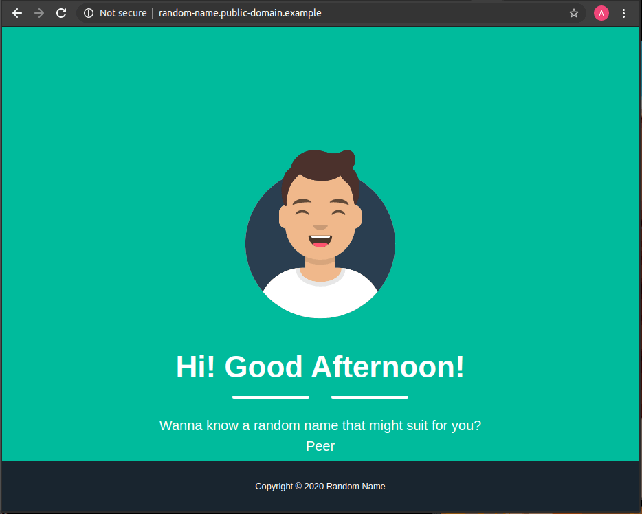

# Random Name Microservice

## Overview
Random name service consists of two microservices which are backend service and frontend service. Backend service used to fetch random user information based on https://api.randomuser.me public API, and the result will be displayed through the frontend service.

---



*refresh your browser to get the new name*

## What this repository covers
- [x] Backend: Get the user information from the https://api.randomuser.me and return the user information via REST API
- [x] Backend: Will remain private. Inaccessible by the public and only accessible from the frontend, it doesn't have a public domain and/or IP
- [x] Backend: Written in Go language
- [x] Frontend: Request the user information to the backend and it will display the name information
- [x] Frontend: Written using React Framework
- [x] Frontend: It can be configured to be accessible through a public domain
- [x] Both of the services are containerized
- [x] Microservices deployment to Kubernetes cluster can be done using Helm chart
- [x] The Helm chart can accommodate auto-scaling and easily toggled on and off in a specific environment, the case here is that it needs auto-scaling in production but certainly do not in staging and development
- [x] Makefile that will simplify the building, containerizing, and deployment in various environments (production, staging, etc)

## Prerequisites
---
Environment used during development are as follow:
1. Go version 1.14.1</br>
   Refer to this [link](https://golang.org/doc/install) on how to setup Go
2. Node.js version v12.17.0</br>
   Refer to this [link](https://nodejs.org/en/download/) for how to get Node.js
3. Docker version 19.03.8</br>
   Refer to this [link](https://docs.docker.com/engine/install/) for how to get Docker up and running
4. Kubernetes version 1.18.0</br>
   Refer to this [link](https://kubernetes.io/docs/setup/) for setting up the kubernetes installation (while we are using [Minikube](https://kubernetes.io/docs/tasks/tools/install-minikube/) during development, and please let `ingress-controller` and `metrics-server` addons enabled as we need that addons to get these apps up and running)
5. Helm version 3.2.1</br>
   Refer to this [link](https://helm.sh/docs/intro/install/) for how to install helm
6. GNU Make 4.2.1</br>
   Refer to this [link](https://www.gnu.org/software/make/) to get more informations about GNU Make
7. Docker-compose version 1.25.5</br>
   Refer to this [link](https://docs.docker.com/compose/install/) to get more informations about docker-compose.

> ℹ️ **Please be noted**, when using Minikube, build the image using the minikube docker env, and this project doesn't push any Docker images to any Docker repository. It assumes your kubernetes cluster have an access to the services Docker image. Or you could push the images to the repository and do the necessary configuration.

## Makefile
---
To get these apps ready, you can directly build the containers from the root directory of this repository.
Run `make` to get details information about its target
```bash
 Choose a target to run:

  build             Build the image with specified target. Accepted value `backend`
                    and `frontend`
  build-all         Build all the images
  compose-up        Run docker compose and shows the services log.
  compose-daemon    Run docker compose in a background.
  chart-review      Review the chart manifest using 'less'.
                    You will be prompted wether you want to enable auto scale or not
  chart-deploy      Deploy the chart to the Kubernetes cluster. You will be prompted where
                    you want deploy the chart and wether you want to enable auto scale or not

```

> ℹ️ Applications are exposed by default on port `8081`, you access this application in your browser `http://localhost:8081` after you run `make compose-up` or `make compose-daemon`.

## Helm Chart
---
Helm chart used to simplify the deployment of the services. For more informations about `randomname-chart`, please refer to chart [README](https://github.com/ermusthofa/randomname/blob/master/randomname-chart/README.md).

## Backend
---
Backend microservice will allow frontend service to fetch random name based on https://randomuser.me. For a detailed explanation, please refer to the service [README](https://github.com/ermusthofa/randomname/blob/master/backend/README.md).

## Frontend
---
Frontend microservice will allow user to get random name fetched from backend service. For a detailed explanation, please refer to the service [README](https://github.com/ermusthofa/randomname/blob/master/frontend/README.md).

## License
This project is licensed under the MIT License - see the [License.md](https://github.com/ermusthofa/randomname/blob/master/LICENSE) file for details